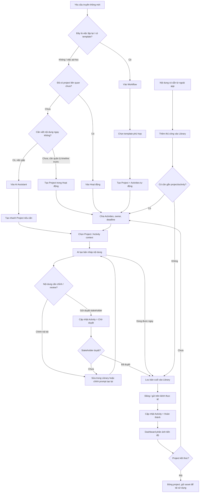

# IC Platform — Internal Communications Hub

IC Platform là web app hỗ trợ team truyền thông nội bộ quản lý toàn bộ vòng đời một chiến dịch: từ nhận brief, tạo dự án, chia nhỏ thành hoạt động, sản xuất nội dung bằng AI, lưu thư viện nội dung, theo dõi tiến độ, đến quản lý người dùng có quyền truy cập.

Dự án hiện được thiết kế như một MVP nội bộ: frontend React/Vite, dữ liệu lưu qua Google Sheets bằng Google Apps Script, AI hỗ trợ tạo nội dung qua Cerebras API.

## 1. Web này dùng để làm gì?

IC Platform giải quyết một vấn đề rất thực tế của team truyền thông: công việc truyền thông nội bộ thường bị rải rác ở nhiều nơi — brief nằm trong chat/email, timeline nằm trong sheet, task nằm trong trí nhớ hoặc file riêng, nội dung AI tạo xong lại copy qua nhiều nơi. App này gom các phần đó vào một workspace chung.

Các nhóm chức năng chính:

| Khu vực | Mục đích | Người dùng sẽ làm gì |
| --- | --- | --- |
| Dashboard | Nhìn tổng quan tiến độ | Xem tổng số hoạt động, trạng thái, deadline sắp tới/quá hạn, tiến độ theo dự án |
| Hoạt động | Quản lý dự án và task truyền thông | Tạo/sửa/xóa dự án, tạo/sửa/xóa hoạt động, đổi trạng thái, quản lý deadline/người phụ trách |
| AI Assistant | Tạo nội dung truyền thông | Chọn dự án/hoạt động, nhập brief, tạo GTalk/email/poster copy/plan/reminder, lưu vào thư viện |
| Workflow | Tạo dự án từ quy trình mẫu | Chọn template như khảo sát nhân viên, town hall, triển khai công cụ mới; app tự tạo project + task |
| Thư viện | Quản lý nội dung đã tạo | Thêm/sửa/xóa/xem/copy nội dung, gắn nội dung với dự án hoặc hoạt động |
| Người dùng | Quản lý quyền truy cập | Admin thêm/sửa/xóa người dùng và phân quyền admin/member |
| Google Sheets backend | Database tạm cho MVP | Lưu Projects, Activities, Contents, Users, WorkflowTemplates để team có thể triển khai nhanh |

## 2. Ai sẽ dùng app này?

### Admin / IC Lead

Người quản lý workspace. Có thể:

- thêm người dùng mới;
- phân quyền admin/member;
- tạo và quản lý dự án;
- theo dõi tình trạng tổng thể trên Dashboard;
- kiểm tra các deadline rủi ro;
- rà soát nội dung đã lưu trong Library.

### IC Executive / Communication Owner

Người trực tiếp triển khai truyền thông. Có thể:

- tạo project hoặc chọn project được giao;
- chia project thành các activity cụ thể;
- dùng AI để tạo nội dung nháp;
- lưu nội dung vào Library;
- chỉnh sửa nội dung sau review;
- cập nhật trạng thái công việc.

### Member / Viewer nội bộ

Người dùng có quyền đăng nhập nhưng không quản trị user. Có thể sử dụng workspace để xem, tạo và vận hành nội dung/dự án tùy theo cách team phân quyền ở giai đoạn MVP.

## 3. Data model hiện tại

Dữ liệu được chia thành 5 sheet chính trong Google Sheets.

### Users

Quản lý người có quyền đăng nhập.

| Field | Ý nghĩa |
| --- | --- |
| email | Email dùng để đăng nhập |
| name | Tên hiển thị |
| role | `admin` hoặc `member` |

### Projects

Một chiến dịch, chương trình hoặc initiative truyền thông.

| Field | Ý nghĩa |
| --- | --- |
| id | Mã project |
| name | Tên dự án |
| description | Mô tả / brief tổng quan |
| assignee | Người phụ trách chính |
| startDate | Ngày bắt đầu |
| deadline | Deadline tổng |
| status | Trạng thái |
| notes | Ghi chú |

### Activities

Các đầu việc cụ thể nằm trong một project.

| Field | Ý nghĩa |
| --- | --- |
| id | Mã activity |
| projectId | Project liên quan |
| name | Tên hoạt động |
| description | Mô tả việc cần làm |
| assignee | Người phụ trách |
| startDate | Ngày bắt đầu |
| deadline | Deadline |
| priority | High / Medium / Low |
| status | Chưa bắt đầu, Đang thực hiện, Chờ duyệt, Hoàn thành... |
| channel | Kênh truyền thông: GTalk, Email, Offline... |
| checklist | Checklist/subtask nhỏ trong activity, lưu dạng JSON |
| attachmentLink | Link tài liệu/thiết kế/file liên quan |
| notes | Ghi chú |

### Contents

Nội dung truyền thông được tạo bằng AI hoặc nhập thủ công.

| Field | Ý nghĩa |
| --- | --- |
| id | Mã content |
| title | Tiêu đề nội dung |
| contentType | Loại nội dung: GTalk, Email, Poster, Reminder... |
| projectId / projectName | Dự án liên quan |
| activityId / activityName | Hoạt động liên quan |
| prompt | Brief/prompt gốc |
| content | Nội dung hoàn chỉnh |
| createdAt | Thời điểm tạo |

### WorkflowTemplates

Quy trình mẫu để tạo nhanh project và activities cho các loại chiến dịch lặp lại.

| Field | Ý nghĩa |
| --- | --- |
| id | Mã template |
| name | Tên workflow template |
| description | Mô tả template |
| category | Nhóm template: survey, announcement, event, campaign, change... |
| estimatedWeeks | Thời lượng triển khai ước tính |
| steps | Danh sách bước/activity mẫu, lưu dạng JSON |

## 4. Workflow làm việc đề xuất cho team truyền thông

Đây là workflow end-to-end nên dùng khi vận hành một chiến dịch truyền thông nội bộ trên IC Platform.

### Workflow diagram tổng quan

Diagram dưới đây mô tả workflow theo hướng linh hoạt hơn một đường thẳng. Người dùng có thể bắt đầu từ `Workflow`, `Hoạt động`, `AI Assistant` hoặc `Thư viện` tùy tình huống thực tế.



Cách đọc diagram:

- `Workflow` phù hợp khi team làm một dạng chiến dịch quen thuộc.
- `Hoạt động` phù hợp khi cần quản lý timeline/task trước.
- `AI Assistant` phù hợp khi cần tạo nội dung nhanh hoặc đang bí copy.
- `Thư viện` phù hợp khi đã có nội dung từ nguồn khác, hoặc cần lưu lại bản cuối để tái sử dụng.
- `Dashboard` chỉ thật sự có giá trị khi team cập nhật status đều đặn.

### Bước 1 — Nhận brief và xác định loại việc

Team nhận yêu cầu từ HR, Operation, Tech, Leadership hoặc stakeholder khác.

Cần xác định:

- mục tiêu truyền thông là gì;
- đối tượng nhận thông tin là ai;
- deadline mong muốn;
- kênh cần dùng: GTalk, email, offline, event, survey;
- có cần thiết kế visual/poster không;
- có cần nhiều đợt reminder không;
- ai là người duyệt cuối.

Nếu đây là một loại việc lặp lại, nên đi qua `Workflow`. Nếu là việc nhỏ/lẻ, có thể tạo trực tiếp trong `Hoạt động` hoặc tạo nhanh từ `AI Assistant`.

### Bước 2 — Tạo Project

Có 3 cách tạo project:

1. Tạo từ `Hoạt động` nếu đã biết rõ dự án cần quản lý.
2. Tạo nhanh trong `AI Assistant` khi đang viết nội dung nhưng chưa có project liên quan.
3. Tạo từ `Workflow` nếu dự án giống một quy trình mẫu, ví dụ:
   - khảo sát nhân viên;
   - town hall;
   - triển khai công cụ mới;
   - chương trình ghi nhận nhân viên;
   - chiến dịch truyền thông nội bộ.

Project nên đại diện cho một chiến dịch có timeline rõ, ví dụ:

- `EES 2026`
- `GTalk Mail Migration`
- `Town Hall Q3`
- `Employee Recognition Program`

### Bước 3 — Chia Project thành Activities

Một project tốt nên được chia thành các hoạt động nhỏ có owner và deadline riêng.

Ví dụ với project `EES 2026`:

| Activity | Channel | Owner | Deadline | Status |
| --- | --- | --- | --- | --- |
| Chuẩn bị bộ câu hỏi khảo sát | Internal | IC/HR | 2026-06-10 | Hoàn thành |
| Launch khảo sát | GTalk + Email | IC | 2026-06-15 | Đang thực hiện |
| Reminder lần 1 | GTalk | IC | 2026-06-20 | Chưa bắt đầu |
| Reminder lần 2 | GTalk | IC | 2026-06-25 | Chưa bắt đầu |
| Tổng hợp kết quả | Internal | HR | 2026-07-01 | Chưa bắt đầu |
| Truyền thông kết quả | GTalk | IC | 2026-07-05 | Chưa bắt đầu |

Lúc này `Dashboard` bắt đầu có ý nghĩa: team thấy được tổng việc, việc quá hạn, việc sắp đến hạn và tiến độ từng project.

### Bước 4 — Dùng AI Assistant để tạo nội dung nháp

Khi cần viết nội dung, user vào `AI Assistant`:

1. chọn project liên quan;
2. chọn activity liên quan nếu có;
3. chọn mục tiêu nội dung hoặc nhập prompt tự do;
4. AI trả về bản nháp ngắn gọn, thực dụng, có thể copy dùng ngay;
5. user chỉnh lại nếu cần;
6. lưu nội dung vào `Thư viện`.

Ví dụ prompt tốt:

```text
Viết GTalk reminder nhắc nhân viên hoàn thành khảo sát EES trước 17h hôm nay. Giọng văn thân thiện, ngắn gọn, không dùng emoji, có CTA rõ.
```

AI không nên là nơi quyết định chiến lược. AI chỉ nên giúp tăng tốc sản xuất bản nháp. Người làm truyền thông vẫn cần kiểm tra:

- thông tin có đúng không;
- tone có phù hợp văn hóa công ty không;
- CTA có rõ không;
- deadline/link/người nhận có chính xác không;
- nội dung có cần stakeholder duyệt không.

### Bước 5 — Lưu và quản lý nội dung trong Library

Sau khi có bản nháp đủ tốt, user lưu vào `Thư viện`.

Library hiện hỗ trợ:

- thêm nội dung thủ công;
- sửa nội dung;
- xóa nội dung;
- copy nội dung;
- xem prompt gốc;
- gắn nội dung với project/activity;
- tìm kiếm theo tiêu đề, loại, dự án, nội dung;
- lọc theo loại nội dung.

Library nên được xem như “kho tài sản truyền thông” của team. Những nội dung đã dùng hoặc đã duyệt nên được giữ lại để tái sử dụng cho các chiến dịch sau.

### Bước 6 — Review và cập nhật trạng thái

Sau khi nội dung được gửi cho lead/stakeholder review, activity nên được cập nhật trạng thái:

| Tình huống | Status nên dùng |
| --- | --- |
| Chưa bắt đầu làm | Chưa bắt đầu |
| Đang viết / đang thiết kế / đang chuẩn bị | Đang thực hiện |
| Đã gửi stakeholder duyệt | Chờ duyệt |
| Đã đăng / đã hoàn tất | Hoàn thành |
| Bị tạm ngưng | Tạm dừng |
| Project đã đóng | Kết thúc |

Việc cập nhật trạng thái đều đặn là điều kiện để Dashboard có giá trị. Nếu team không update status, dashboard sẽ chỉ đẹp chứ không phản ánh thực tế.

### Bước 7 — Theo dõi Dashboard hằng ngày

Mỗi ngày, IC lead hoặc owner nên mở Dashboard để xem:

- hoạt động nào quá hạn;
- hoạt động nào sắp tới deadline;
- project nào đang bị chậm;
- tỷ lệ hoàn thành tổng thể;
- phân bổ trạng thái hiện tại;
- workload theo project.

Dashboard nên là nơi trả lời câu hỏi: “Hôm nay team truyền thông cần chú ý việc gì nhất?”.

### Bước 8 — Đóng project và tái sử dụng tài sản

Khi project kết thúc:

1. cập nhật các activity còn lại thành `Hoàn thành` hoặc `Kết thúc`;
2. lưu lại các nội dung cuối cùng trong Library;
3. ghi chú insight hoặc link báo cáo vào project/activity;
4. nếu đây là quy trình lặp lại, cân nhắc biến nó thành workflow template mới.

## 5. Ví dụ workflow đầy đủ: triển khai một khảo sát nhân viên

### Tình huống

HR yêu cầu IC team truyền thông cho khảo sát nhân viên 2026. Mục tiêu là nhân viên hiểu khảo sát dùng để làm gì, tham gia đúng hạn và biết kết quả sẽ được dùng ra sao.

### Cách làm trên IC Platform

1. Vào `Workflow`.
2. Chọn template `Khảo sát nhân viên`.
3. Điền tên project: `EES 2026`.
4. Chọn owner và ngày bắt đầu.
5. App tự tạo project và các activity như:
   - nhận yêu cầu & lên kế hoạch;
   - xây dựng nội dung khảo sát;
   - truyền thông launch khảo sát;
   - reminder lần 1;
   - reminder lần 2 & đóng khảo sát;
   - tổng hợp & phân tích kết quả;
   - truyền thông kết quả.
6. Vào `Hoạt động` để kiểm tra timeline, owner, deadline.
7. Vào `AI Assistant`, chọn project `EES 2026`, chọn activity `Truyền thông launch khảo sát`.
8. Nhập prompt yêu cầu viết GTalk/email launch.
9. Copy bản nháp hoặc lưu vào `Thư viện`.
10. Sau khi stakeholder duyệt, cập nhật activity thành `Hoàn thành`.
11. Tới ngày reminder, chọn activity reminder và dùng AI tạo nội dung reminder.
12. Theo dõi Dashboard để xem còn activity nào trễ hoặc sắp đến hạn.
13. Khi khảo sát đóng, lưu nội dung recap/kết quả vào Library và đóng project.

## 6. Đánh giá UX theo nhiều tình huống thao tác thực tế

Nếu đọc README như một người làm truyền thông, web hiện tại đã có nền tảng đúng: có project, task, AI, library, dashboard và quản lý user. Sau đợt cải thiện mới, app đã có thêm `Start here`, `Today focus`, `Project Brief`, lifecycle cho Content và approval metadata cơ bản.

Nói ngắn gọn: app hiện **dùng được cho MVP** và đã có lớp dẫn đường cơ bản. Tuy vậy, vì công việc truyền thông rất định tính, sản phẩm vẫn cần tiếp tục cải thiện review flow, versioning, deep link, permission và workload để sát thực tế hơn.

### Scenario 1 — Việc bài bản, có brief rõ từ đầu

Ví dụ: HR gửi brief khảo sát nhân viên, có timeline, có nhóm người nhận, có deadline.

Luồng hiện tại khá ổn:

1. Vào `Workflow` nếu có template phù hợp.
2. Tạo project + activity tự động.
3. Vào `Hoạt động` chỉnh owner/deadline và điền Project Brief.
4. Vào `AI Assistant` tạo nội dung dựa trên brief.
5. Lưu bản cuối vào `Library`.
6. Theo dõi trên `Dashboard`.

Điểm ổn:

- Có template giúp tiết kiệm thao tác.
- Có project/activity để theo dõi deadline.
- Project đã có brief cấu trúc: objective, audience, key message, CTA, channels, tone, stakeholder, success metric, mandatory info.
- AI Assistant đã đọc Project Brief và activity review context khi tạo nội dung.
- Workflow template đã có thể thêm/sửa/xóa trên UI, nên team tự chuẩn hóa được quy trình lặp lại.
- Activity tạo từ template đã có checklist/subtask mặc định để dễ triển khai.

Điểm còn cấn:

- Brief chưa được hiển thị như một trang detail riêng đẹp và dễ scan.

Kết luận: Project Brief + Workflow Template CRUD đã giải quyết phần cấn lớn nhất; gap tiếp theo là project detail rõ hơn và deep link tới đúng item.

### Scenario 2 — Việc gấp, chỉ cần viết nội dung ngay

Ví dụ: sếp nhắn “em viết giúp anh một GTalk reminder gửi trong 15 phút nữa”.

Luồng người dùng tự nhiên có thể là:

1. Vào `Dashboard` và chọn action `Viết nội dung gấp`, hoặc vào thẳng `AI Assistant`.
2. Nhập prompt.
3. Copy nội dung gửi đi.
4. Sau đó lưu vào `Library` hoặc tạo/gắn project nếu cần tracking.

Điểm ổn:

- Dashboard đã có `Start here` để user không bị lạc.
- AI Assistant có thể dùng ngay.
- Có tạo nhanh project trong AI nếu chưa có project.
- Có lưu Library sau khi tạo.

Điểm còn cấn:

- Sau khi AI tạo nội dung, app chưa chủ động hỏi “Bạn có muốn gắn nội dung này vào project/activity không?”.
- Nếu không gắn project/activity, nội dung trong Library vẫn có thể rời rạc.

Kết luận: đã có entry rõ hơn cho việc gấp; bước sau là thêm gợi ý gắn context sau khi AI tạo nội dung.

### Scenario 3 — Việc bắt đầu từ content có sẵn bên ngoài

Ví dụ: stakeholder gửi một đoạn email draft, IC chỉ cần polish lại và lưu bản cuối.

Luồng hiện tại:

1. Vào `Thư viện`.
2. Thêm nội dung thủ công.
3. Gắn project/activity nếu có.
4. Chọn lifecycle status: Draft, In review, Approved, Published, Archived.
5. Lưu approver, review notes, published date nếu cần.
6. Sửa/copy khi cần.

Điểm ổn:

- Library đã có CRUD.
- Có thể gắn project/activity.
- Có thể lưu prompt/brief gốc.
- Content đã có lifecycle và thông tin review cơ bản.

Điểm còn cấn:

- AI Assistant chưa có flow “rewrite nội dung đang có trong Library”.
- Chưa có version history, nên nếu sửa nhiều vòng sẽ mất dấu bản cũ.

Kết luận: lifecycle cơ bản đã có; gap tiếp theo là rewrite/version history.

### Scenario 4 — Việc bị review nhiều vòng

Ví dụ: bài launch phải qua IC lead, HR lead, Legal/Compliance rồi mới đăng.

Luồng hiện tại:

- Activity có status `Chờ duyệt`.
- Activity có approver, review due date, review notes.
- Content có lifecycle + approver + review notes.

Điểm ổn:

- Biết ai đang duyệt.
- Biết hạn review.
- Có nơi ghi feedback/review notes.
- Content có trạng thái Draft/In review/Approved/Published/Archived.

Điểm còn cấn:

- Chưa có version nội dung.
- Chưa có approve/reject action riêng, hiện vẫn là field/trạng thái thủ công.
- Chưa có lịch sử ai duyệt lúc nào.

Kết luận: đã có approval metadata ở mức MVP; nếu dùng thật cần version history và approve/reject flow riêng.

### Scenario 5 — Một project có nhiều người cùng làm

Ví dụ: một campaign gồm người viết copy, designer, IC lead, HR owner.

Luồng hiện tại:

- Project có một `assignee`.
- Activity có một `assignee`.
- Activity có priority/status/deadline.
- Activity có review owner riêng nếu cần.

Điểm ổn:

- Với team nhỏ, single owner là đủ cho MVP.
- Activity-level owner giúp chia việc cơ bản.
- Review metadata giúp tách người làm và người duyệt.

Điểm còn cấn:

- Không có collaborators.
- Activity đã có checklist/subtask để bẻ nhỏ việc cần làm.
- Không có dependency giữa các task.
- Không có workload theo từng người.

Kết luận: checklist đã giúp activity sát thực tế hơn; nếu nhiều người cùng làm, gap tiếp theo là collaborators, dependency và workload theo từng người.

### Scenario 6 — IC Lead muốn biết hôm nay cần xử lý gì

Luồng hiện tại:

1. Vào `Dashboard`.
2. Xem `Today focus`.
3. Xử lý việc quá hạn, sắp đến hạn, chờ duyệt, chưa có owner hoặc content approved nhưng chưa publish.
4. Vào `Hoạt động` hoặc `Thư viện` để xử lý chi tiết.

Điểm ổn:

- Dashboard đã có `Today focus`.
- Đã gom các việc cần hành động ngay.
- User không còn phải tự suy luận hoàn toàn từ chart/card.

Điểm còn cấn:

- Focus item mới điều hướng tới khu vực xử lý, chưa deep link đúng item.
- Chưa filter theo owner.
- Chưa sort theo mức độ ưu tiên chi tiết.

Kết luận: Dashboard đã chuyển một bước từ reporting sang action center; cần cải thiện tiếp bằng deep link/filter/sort.

### Scenario 7 — Admin onboarding người mới

Luồng hiện tại:

1. Vào `Người dùng`.
2. Thêm email/name/role.
3. Người mới đăng nhập bằng email đã được thêm.

Điểm ổn:

- CRUD user đã có.
- Admin không cần mở Google Sheet.
- Chặn tự xóa chính mình.

Điểm còn cấn:

- Role mới chỉ có `admin/member`, chưa có permission chi tiết.
- Member hiện vẫn có thể thao tác nhiều phần; chưa có read-only/editor separation.
- Chưa có audit log ai đã thêm/sửa/xóa dữ liệu.

Kết luận: đủ cho MVP nội bộ, chưa đủ cho production hoặc team lớn.

## 7. Các điểm cấn product nên ưu tiên xử lý tiếp

Từ các scenario trên, nhiều điểm cấn lớn đã được xử lý ở mức MVP. Các vấn đề còn lại nên ưu tiên như sau.

### 1. Start here đã có, nhưng còn nên nâng thành wizard

Dashboard hiện đã có `Start here` với các hướng bắt đầu phổ biến: tạo chiến dịch, viết nội dung gấp, quản lý task/deadline, lưu/chỉnh nội dung có sẵn.

Bước tiếp theo nên là wizard thông minh hơn: hỏi user vài câu ngắn rồi tự đề xuất flow phù hợp, ví dụ tạo project từ template hay vào AI Assistant trước.

### 2. Project Brief đã có cấu trúc

Project hiện đã có các field brief quan trọng: objective, audience, key message, CTA, channels, tone of voice, stakeholder, success metric và mandatory info.

AI Assistant cũng đã dùng các field này làm context. Bước tiếp theo là hiển thị brief đẹp hơn trong trang project detail và dùng brief để gợi ý activity/content tự động.

### 3. Content đã có lifecycle cơ bản

Content hiện có trạng thái: Draft, In review, Approved, Published, Archived. Ngoài ra có approver, review notes và published date.

Gap còn lại là version history và action rõ ràng như Send review / Approve / Publish.

### 4. Review/approval đã có metadata MVP

Activity hiện có approver, review due date và review notes. Content có approver, review notes và lifecycle.

Gap còn lại: approved at, rejected reason, version history và action approve/reject/publish đúng nghĩa.

### 5. Dashboard đã có Today focus

Dashboard hiện đã có `Today focus` gồm việc quá hạn, sắp đến hạn, chờ duyệt, chưa có owner và content đã approved nhưng chưa published.

Gap còn lại là deep link tới đúng activity/content, filter theo owner và sort theo mức độ ưu tiên.

### 6. Workflow Templates đã có CRUD

Template hiện đã có thể thêm/sửa/xóa ngay trong UI. Team có thể tự tạo template cho:

- onboarding;
- policy announcement;
- system downtime;
- internal event;
- survey;
- emergency communication.

Gap còn lại là thư viện template nâng cao: duplicate template, import/export template và gợi ý template bằng AI từ brief.

### 7. Activity đã có checklist/subtask

Một activity truyền thông thường không phải một hành động đơn, nên activity hiện đã có checklist nhỏ bên trong để tracking thực tế hơn.

Gap còn lại là checklist template nâng cao, dependency giữa các item và người phụ trách riêng cho từng subtask.

## 8. Roadmap đề xuất sau khi nhìn workflow

Nếu muốn chỉnh app cho sát cách IC team làm việc hơn, thứ tự ưu tiên nên là:

1. Hoàn thành: `Project Brief` có cấu trúc.
2. Hoàn thành: `Start here` và `Today focus` trên Dashboard.
3. Hoàn thành: lifecycle/status cho Content.
4. Hoàn thành mức MVP: approval fields cho Activity/Content.
5. Hoàn thành: checklist/subtask trong Activity.
6. Hoàn thành: CRUD cho Workflow Templates.
7. Tiếp theo: deep link/filter cho Today focus.
8. Tiếp theo: nâng permission roles admin/editor/viewer.
9. Sau đó mới tính backend production thay Google Sheets.
## 9. Chạy local

Yêu cầu Node.js 20+.

```bash
npm install
Copy-Item .env.example .env
npm run dev
```

Điền các biến trong `.env`. Sau mỗi lần thay đổi `.env`, khởi động lại Vite.

```env
VITE_GOOGLE_SHEETS_API_URL=https://script.google.com/macros/s/YOUR_DEPLOYMENT_ID/exec
VITE_CEREBRAS_API_KEY=your_cerebras_api_key_here
VITE_CEREBRAS_MODEL=gpt-oss-120b
```

Nếu `VITE_GOOGLE_SHEETS_API_URL` để trống, ứng dụng chạy bằng mock data và không ghi gì vào Google Sheets.

## 10. Thiết lập Google Sheets

1. Tạo một Google Sheet dành riêng cho IC Platform.
2. Chọn **Extensions → Apps Script**.
3. Dán toàn bộ nội dung từ [google-apps-script.js](google-apps-script.js), lưu project.
4. Trong danh sách hàm, chạy `setupSheets` một lần và cấp quyền Google khi được hỏi. Hàm này tạo/cập nhật các sheet `Projects`, `Activities`, `Contents`, `Users`, `WorkflowTemplates` và thêm cột còn thiếu mà không xóa dữ liệu cũ.
5. Mở sheet `Users`, thêm ít nhất một hàng theo mẫu:

   | email | name | role |
   | --- | --- | --- |
   | your-email@company.com | Tên của bạn | admin |

6. Chọn **Deploy → New deployment → Web app**. Chọn **Execute as: Me** và, cho MVP nội bộ, **Who has access: Anyone**.
7. Sao chép URL Web app kết thúc bằng `/exec` vào `VITE_GOOGLE_SHEETS_API_URL`.

Để kiểm tra API trước khi chạy app, mở URL sau trên trình duyệt. Kết quả đúng là JSON có `projects`, `activities`, `contents`, `users`, `workflowTemplates`.

```text
https://script.google.com/macros/s/YOUR_DEPLOYMENT_ID/exec?action=getAll
```

Mỗi khi chỉnh `google-apps-script.js`, tạo version mới và chọn **Manage deployments → Edit → New version → Deploy**. URL `/exec` vẫn giữ nguyên.

## 11. Deploy Vercel

1. Đẩy source lên GitHub và import repository vào Vercel.
2. Framework preset: **Vite**.
3. Build command: `npm run build`.
4. Output directory: `dist`.
5. Trong **Settings → Environment Variables**, thêm:
   - `VITE_GOOGLE_SHEETS_API_URL`
   - `VITE_CEREBRAS_API_KEY`
   - `VITE_CEREBRAS_MODEL`
6. Redeploy.
7. Đăng nhập bằng email đã thêm vào sheet `Users`.
8. Tạo thử một project, một activity, một content và kiểm tra các hàng tương ứng xuất hiện trong Google Sheets.

## 12. Kiểm tra nhanh khi có lỗi

- App vẫn hiện dữ liệu EES/GTalk Mail: URL Sheets trống, sai, hoặc chưa restart app sau khi đổi `.env`.
- Không đăng nhập được: kiểm tra URL `/exec`, sheet `Users`, và email phải khớp không phân biệt hoa/thường.
- App báo không thể lưu: mở URL `?action=getAll`; nếu lỗi, redeploy Apps Script và kiểm tra quyền truy cập Web app.
- Tạo mới nhưng sau đó không sửa/xóa được: chạy lại `setupSheets()` để bổ sung cột mới, sau đó redeploy Apps Script mới nhất.
- AI báo không kết nối được: kiểm tra `VITE_CEREBRAS_API_KEY`, model trong `VITE_CEREBRAS_MODEL`, và restart Vite.
- Dữ liệu lưu ở web nhưng refresh mất: app đang chạy mock mode hoặc Apps Script chưa deploy đúng version.

## 13. Lưu ý bảo mật

Đây là cách triển khai nhanh cho MVP nội bộ. Google Apps Script Web app để `Anyone` và mọi biến `VITE_*` đều được gửi xuống trình duyệt. Do đó không nên lưu dữ liệu nhạy cảm hay dùng API key Cerebras production không giới hạn.

Nếu cần đưa vào production rộng rãi, bước tiếp theo nên là thêm backend/proxy có xác thực thật, ví dụ Google Workspace SSO, Firebase/Auth0 hoặc backend riêng. Khi đó secret AI phải nằm ở server, không nằm trong frontend.
